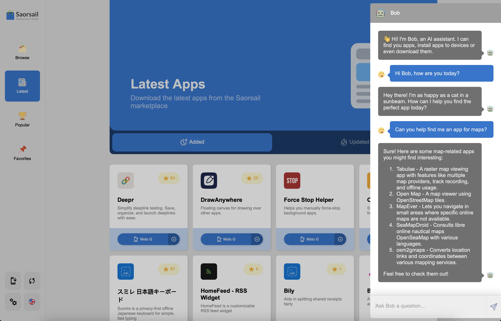

# Bob

Bob is a tool that is composed of three core components:

1. [ngx-bob](https://github.com/scottstraughan/ngx-bob/tree/main/projects/bob)
2. [bob-brain](https://github.com/scottstraughan/bob-brain)
3. [embedding-layer](https://github.com/scottstraughan/saorsail-popular-db/blob/main/src/embeddings/__init__.py)

This repository contains the source code for `ngx-box`, an Angular component that allows you to send and receive 
messages with Bob.

It features these core things:

- Floating Bob widget
- Chat window
- Ability to send and receive messages from bob-brain
- Chat history, stored to local storage
- Error handling
- Some special commands
- Ability to search saorsail.com

## Development

Feel free to create to PRs with changes.

## License

MIT